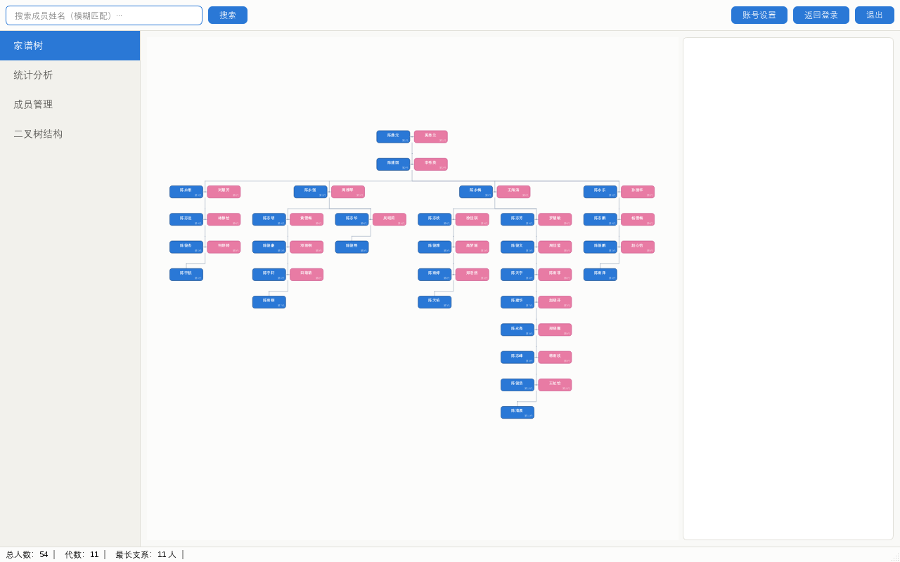
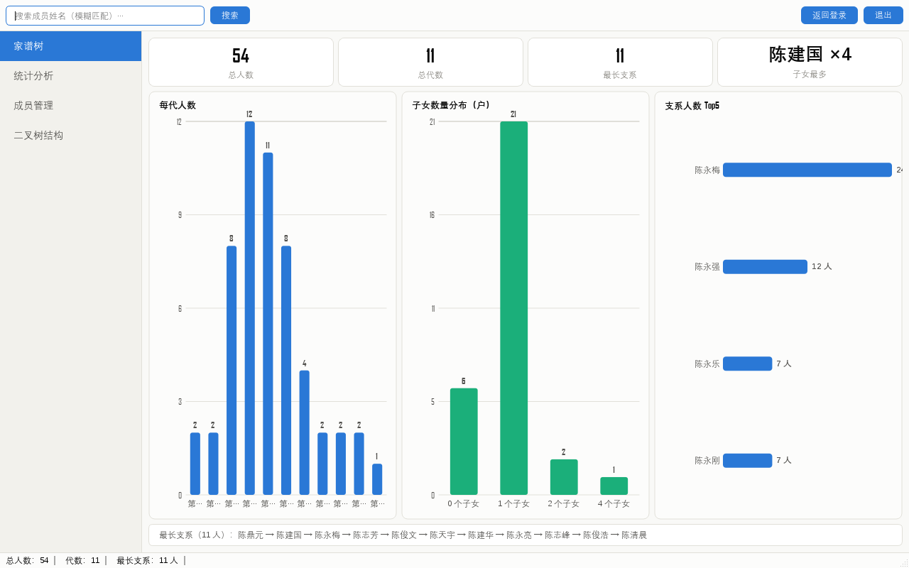
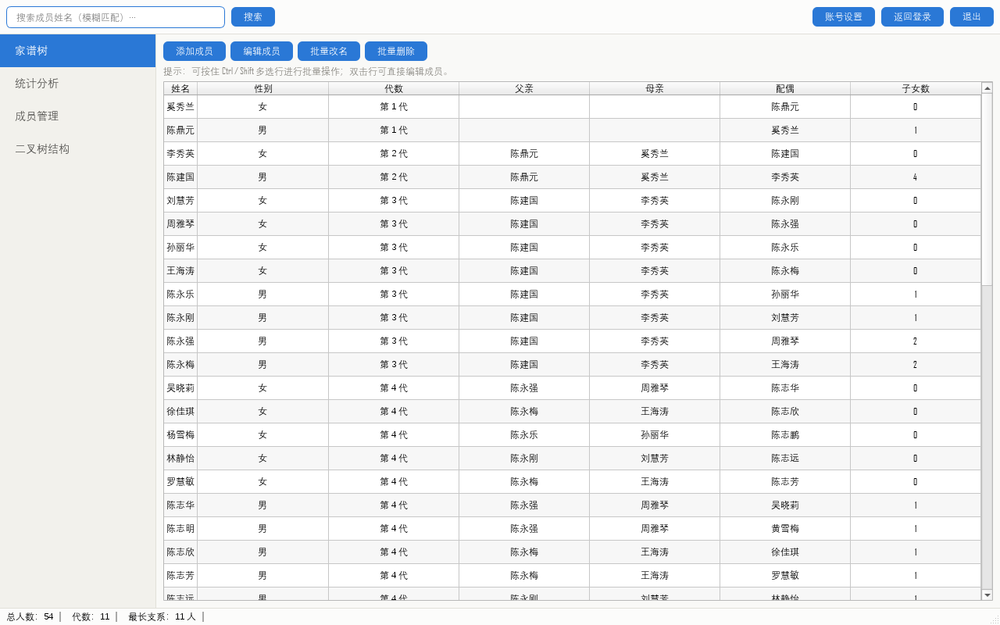
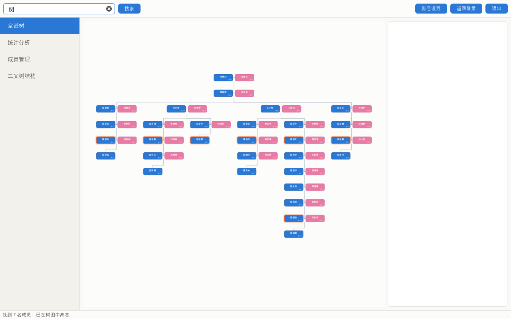

# 家谱管理系统（Jiapu）

基于 **Qt 6 / C++17** 的桌面家谱管理应用，以「左孩子-右兄弟」式**二叉树**为核心数据结构（数据结构课程设计），并在此基础上构建了成员索引层、可视化树形图、统计图表与完整的增删改查管线。

> 原项目为 Qt 5 课设初版；本仓库为重构升级版：修复全部已知缺陷、迁移 Qt 6 + CMake、新增数据可视化与成员管理，并配备 25 项自动化测试。

## 功能特性

- **家谱树可视化**：基于 `QGraphicsView` 自研渲染引擎，54 人 11 代家谱树一键呈现
  - 夫妻同层卡片（男蓝 / 女粉 + 代际角标），正交连线 + 婚姻连线
  - 滚轮缩放（锚定光标，0.1x~4x）、拖拽平移、单击查看成员详情、双击居中
  - 叶槽位布局算法（后序分配 + 前序重叠修正），任意规模不重叠
- **统计分析**：QPainter 自绘图表（零第三方图表库依赖）
  - KPI 卡片：总人数 / 代数 / 最长支系 / 子女最多
  - 每代人数分布、子女数量分布、支系人数 Top-5、最长支系路径
- **成员管理**：成员表格（7 列，按代际排序）、添加成员（六重校验）、级联删除后代、重命名
- **模糊搜索**：姓名包含匹配，命中节点在树图中高亮并自动定位
- **数据持久化**：UTF-8 CSV 文本存储；自动迁移旧版 GBK 数据文件
- **登录**：SHA-256 密码哈希（`config.ini`），回车快捷登录，背景轮播
- **课设功能保留**：「二叉树结构」页输出括号表示法、全部记录与家谱文本树

## 界面预览

| 家谱树（可缩放/拖拽/点击） | 统计分析 |
|:---:|:---:|
|  |  |
| **成员管理** | **搜索高亮** |
|  |  |

## 架构设计

```
┌─────────────────────────────────────────────────┐
│  UI 层      login → MainWindow（代码构建布局）      │
│             家谱树页 | 统计页 | 成员页 | 二叉树结构页 │
├─────────────────────────────────────────────────┤
│  业务层     FamData 成员索引（map<姓名, MemberInfo>）│
│             查询/统计/增删改（全带校验与中文错误信息）  │
├─────────────────────────────────────────────────┤
│  数据层     BTree 二叉树（课设核心，左孩子-右兄弟编码） │
│             父亲→lchild=妻，妻→rchild=儿子链，       │
│             儿子→rchild=兄弟，儿子→lchild=己妻        │
├─────────────────────────────────────────────────┤
│  持久化     UTF-8 CSV（父亲,母亲,儿子），GBK 自动迁移  │
└─────────────────────────────────────────────────┘
```

设计要点：业务逻辑全部基于**平面成员索引**而非二叉树遍历——从结构上消除了「左孩子-右兄弟」编码的查询歧义（兄弟/儿子误判、同名多节点等）；二叉树专责课设要求的括号表示法等展示功能。

## 构建

环境：Windows + [MSYS2](https://www.msys2.org/)（UCRT64 工具链）

```bash
pacman -S --needed base-devel mingw-w64-ucrt-x86_64-toolchain \
  mingw-w64-ucrt-x86_64-cmake mingw-w64-ucrt-x86_64-ninja mingw-w64-ucrt-x86_64-qt6-base

export PATH=/ucrt64/bin:$PATH
cmake -S . -B build -G Ninja -DCMAKE_BUILD_TYPE=Release
cmake --build build
./build/jiapu.exe
```

打包分发（一键脚本，自动补齐 MinGW 运行库依赖）：

```bash
bash tools/package.sh   # 产出 dist/jiapu（约 85MB，可直接分发）
```

> 注意：`windeployqt` 只复制 Qt 动态库，不会复制编译器运行库（`libstdc++-6.dll`、`libgcc_s_seh-1.dll` 等），直接打包会导致目标机器报"找不到 libstdc++-6.dll"。`tools/package.sh` 会自动扫描并补齐全部依赖。

## 测试

```bash
ctest --test-dir build --output-on-failure
```

| 测试 | 覆盖 |
|---|---|
| `tst_datalayer`（19 项） | 数据加载/统计（54人、11代、支系等断言）、祖先/子女查询、增删改全部校验路径（幽灵记录、重名、逗号、母亲不一致等回归）、GBK 旧文件自动迁移、括号表示法、内存释放 |
| `tst_ui`（6 项） | 离屏渲染冒烟：四页截图 + 像素颜色断言（树图男女节点、图表柱体、搜索高亮、成员表格） |

默认账号：`admin` / `12345`（密码仅存 SHA-256 哈希，首运行自动播种至 `config.ini`）。

## 数据格式

`familytreedata.txt`（UTF-8 CSV，每行一条记录）：

```
陈鼎元,奚秀兰,陈建国
陈建国,李秀英,陈永刚
...
```

约束：一人一节点（姓名唯一）；一夫一妻；父亲必须在谱中（拒绝幽灵记录）。

## 主要重构与缺陷修复

| 原缺陷 | 修复 |
|---|---|
| 登录窗口析构双重释放 `bgTimer`（退出崩溃） | 交由 QObject 父子机制管理 |
| 主窗口关闭后进程后台残留（login 仅 hide） | `quitOnLastWindowClosed` + 关闭登录窗口 |
| 背景图片路径缺 `.jpg` 扩展名（一直空白） | 修正全部资源路径 |
| `strncpy` 无终止符、`fam[100]` 越界 | `qstrncpy` + 1000 条上限 |
| 「查找儿子」把兄弟误报为儿子 | 改由成员索引查询，结构上消除 |
| GBK 字节按 UTF-8 二次解码（乱码） | 数据 UTF-8 化 + 统一编解码 |
| 添加记录无校验（幽灵记录/逗号破坏 CSV/重复） | 六重校验 + 中文错误提示 |
| 同名双节点致查找祖先/后代错乱 | 数据清洗 + 加载时冲突检测 |
| 树节点内存泄漏 | `FreeTree` / `FreeFamData` |
| `qt_standard_project_setup` 未启用 AUTORCC（资源丢失） | 显式 `CMAKE_AUTORCC ON` |

## 技术栈

Qt 6.11 Widgets ・ C++17 ・ CMake/Ninja ・ QGraphicsView 自绘图形引擎 ・ QPainter 自绘图表 ・ QtTest 自动化测试（25 项）
